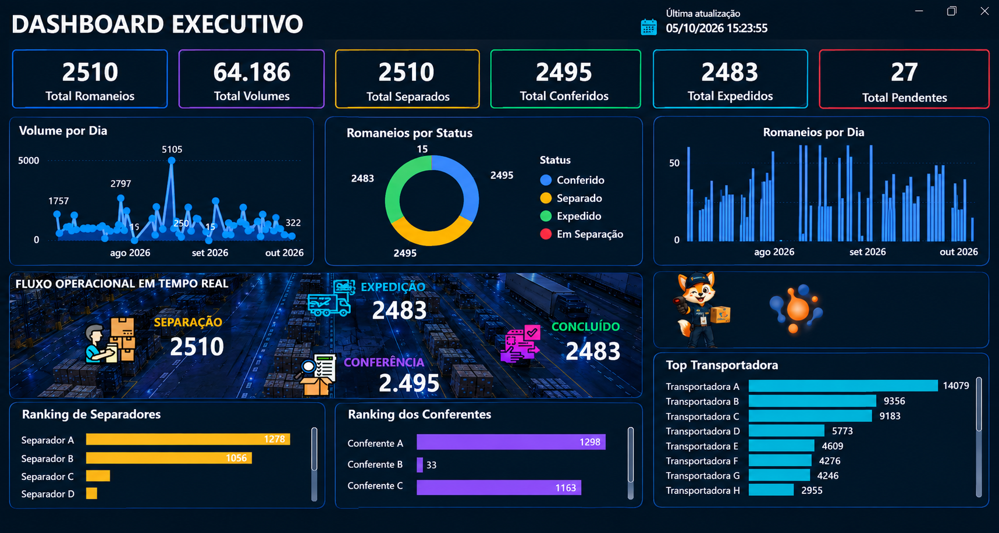
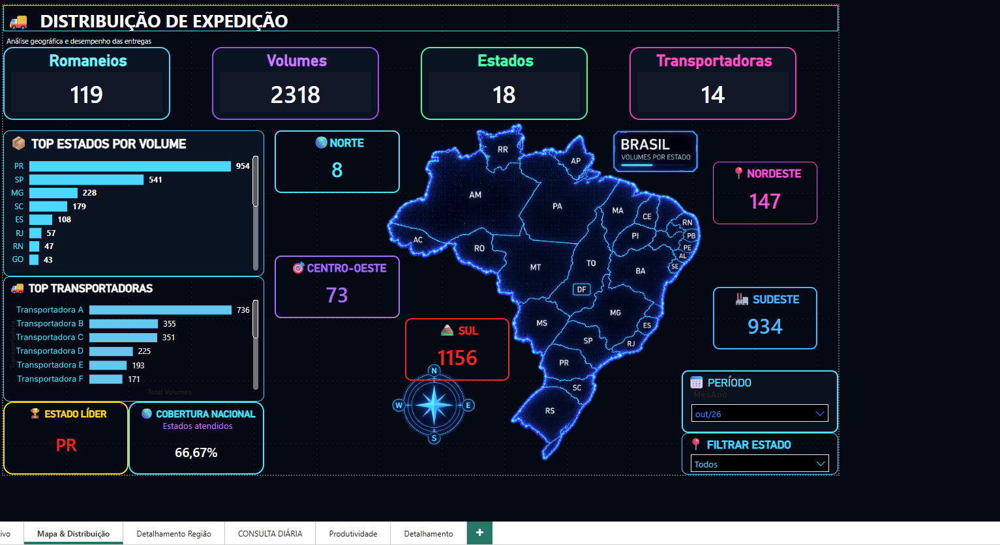
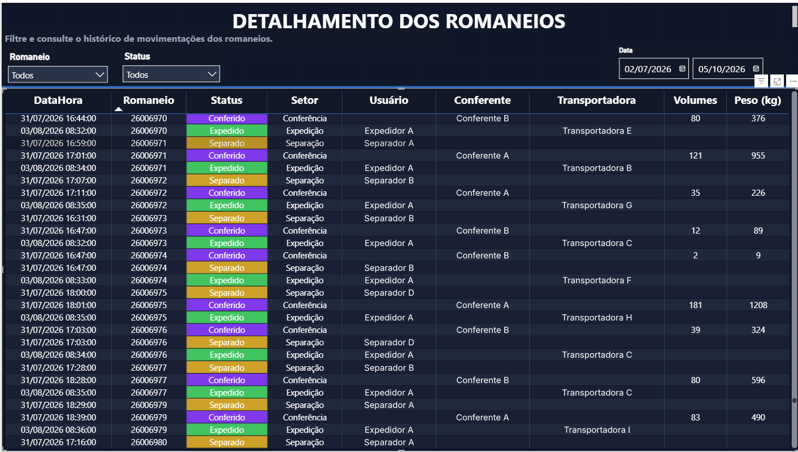
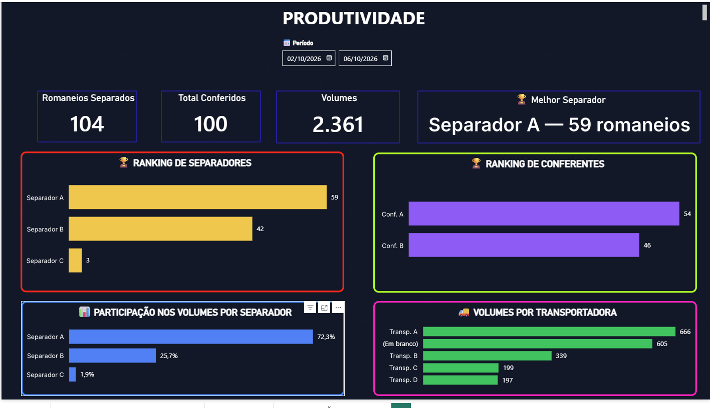

# 🚚 Dashboard de Gestão Logística

Projeto de análise de dados aplicado à área de logística, desenvolvido com **Excel, VBA e Power BI**.

A solução transforma dados operacionais de romaneios em indicadores e dashboards para acompanhamento da operação, produtividade, transportadoras e distribuição das cargas.

> **Observação:** os dados, nomes e informações apresentados foram anonimizados para fins de portfólio.

---

## 🎯 Objetivo

Desenvolver uma ferramenta de acompanhamento da operação logística, permitindo analisar:

- Romaneios e volumes movimentados
- Status da operação
- Produtividade dos operadores
- Transportadoras
- Distribuição por estado e região
- Evolução da operação

---

## 🛠️ Tecnologias

- **Excel** — organização e tratamento dos dados
- **VBA** — automação de rotinas
- **Power BI** — dashboards e visualizações
- **DAX** — medidas e indicadores
- **Análise de Dados** — tratamento e interpretação das informações

---

## 📊 Dashboards

### Dashboard Executivo

Visão geral da operação com os principais indicadores de acompanhamento logístico.

---

### 🌎 Mapa e Distribuição

Análise da distribuição das cargas por estado, região e transportadora.

---

### 📦 Detalhamento da Operação

Visualização detalhada dos romaneios e informações operacionais.

---

### 📈 Produtividade

Análise da produtividade dos operadores envolvidos na operação logística.

---

## 💡 Aplicação prática

O projeto demonstra como dados operacionais podem ser transformados em **indicadores e visualizações para apoiar o acompanhamento e a tomada de decisão na operação logística**.

---

## 👨‍💻 Portfólio

Projeto desenvolvido com foco em **Análise de Dados aplicada à Logística**.

**Tecnologias:** Excel | VBA | Power BI | DAX
Projeto desenvolvido com foco em **análise de dados aplicada à logística**, utilizando dados operacionais para construção de indicadores, dashboards e análises de desempenho.

**Tecnologias:** Excel | VBA | Power BI | DAX | Análise de Dados
